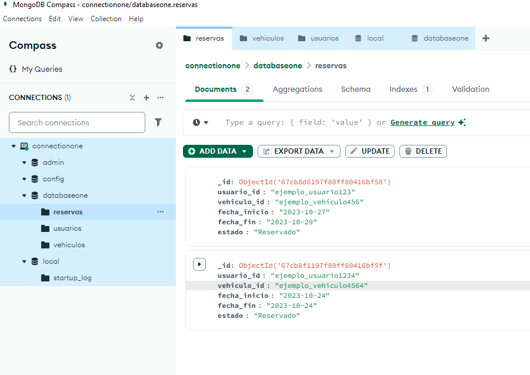

# BackendPythonNOSQL

REFERENCIAS
Se debe instalar mongoDB
https://www.youtube.com/watch?v=2rAIiNgU79w

IMAGEN DE CREACION DE LA BD pero creo que falta en el último campo 

<!-- Si tu base de datos tiene autenticación, deberás modificar la URI de conexión para incluir usuario y contraseña. Por ejemplo: "mongodb://<usuario>:<contraseña>@localhost:27017/". -->